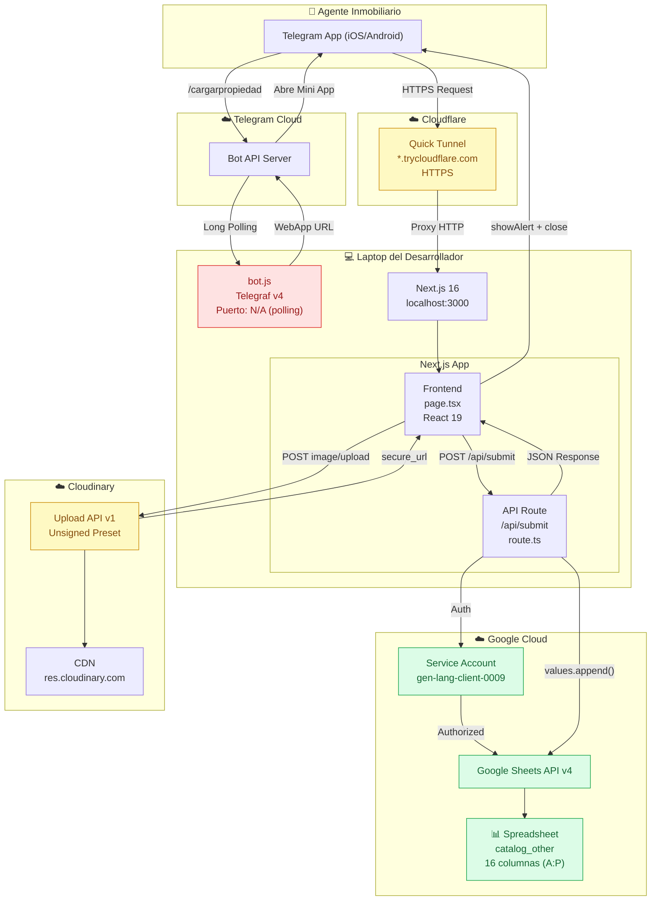

# 🔍 Auditoría Completa del Ecosistema — Lumark Group Telegram Mini App

> **Auditor:** Arquitecto de Software Senior / Auditor de Sistemas  
> **Fecha:** 29 de Junio de 2026  
> **Versión auditada:** v0.1.0  
> **Stack:** Next.js 16 + Telegraf + Google Sheets API + Cloudinary  

---

# 1. AUDITORÍA DEL SISTEMA

## 1.1 Código — Calificación General: 7.2/10

### Frontend — [page.tsx](file:///Users/axelsoberanes/Desktop/BOT%20TELEGRAM/telegram-property-app/src/app/page.tsx)

| Criterio | Calificación | Observación |
|---|---|---|
| Estructura | ⭐⭐⭐⭐ | Componente único bien organizado en pasos |
| Legibilidad | ⭐⭐⭐⭐ | Nombres claros, constantes separadas |
| Modularidad | ⭐⭐⭐ | Todo en un solo archivo de 464 líneas — debería dividirse |
| Seguridad | ⭐⭐⭐⭐ | Cloudinary creds en env vars, no hardcoded |
| Performance | ⭐⭐⭐⭐ | Componente ligero, sin dependencias pesadas |
| Tipado | ⭐⭐⭐⭐ | Interface `FormData` correcta, `keyof` para acceso dinámico |

**Hallazgos:**
- ✅ `suppressHydrationWarning` correctamente aplicado para Telegram
- ✅ `AbortController` con timeout de 15s en envío
- ✅ `inputMode="decimal"` para teclados numéricos en iOS
- ⚠️ `handleChange` usado como `onBlur` — funciona pero debería ser un handler específico
- ⚠️ La interfaz `FormData` sombrea la API nativa del navegador (`window.FormData`)
- ⚠️ Sin validación de campos obligatorios antes de avanzar de paso
- ❌ 464 líneas en un solo componente — violación del principio de responsabilidad única

### Backend API — [route.ts](file:///Users/axelsoberanes/Desktop/BOT%20TELEGRAM/telegram-property-app/src/app/api/submit/route.ts)

| Criterio | Calificación | Observación |
|---|---|---|
| Estructura | ⭐⭐⭐⭐⭐ | Limpio, lineal, sin complejidad innecesaria |
| Seguridad | ⭐⭐⭐⭐ | Creds en env vars, validación de variables |
| Manejo de errores | ⭐⭐⭐⭐ | Try/catch con mensajes descriptivos |
| Tipado | ⭐⭐⭐⭐ | Interface `PropertyBody` bien definida |
| Performance | ⭐⭐⭐ | Hace 2 llamadas a Google API por request (get + append) |

**Hallazgos:**
- ✅ Detección automática de nombre de hoja por `gid`
- ✅ ID autogenerado con formato `XX-NNN-NNN`
- ⚠️ Sin validación del body (campos vacíos, tipos incorrectos)
- ⚠️ Sin rate limiting — cualquiera podría hacer spam de POSTs
- ⚠️ La consulta `spreadsheets.get()` se ejecuta en CADA request — debería cachearse
- ❌ Sin logs estructurados (solo `console.log`)

### Bot de Telegram — [bot.js](file:///Users/axelsoberanes/Desktop/BOT%20TELEGRAM/telegram-property-app/bot.js)

| Criterio | Calificación | Observación |
|---|---|---|
| Funcionalidad | ⭐⭐⭐⭐ | Funciona correctamente |
| Seguridad | ⭐ | **TOKEN HARDCODED EN CÓDIGO FUENTE** |
| Modularidad | ⭐⭐⭐ | Archivo pequeño pero no usa env vars |
| Manejo de errores | ⭐⭐ | Solo SIGINT/SIGTERM, sin error handler global |
| Escalabilidad | ⭐⭐ | JavaScript puro, sin TypeScript |

**Hallazgos:**
> [!CAUTION]
> **RIESGO CRÍTICO DE SEGURIDAD:** El token del bot (`BOT_TOKEN`) está hardcodeado directamente en `bot.js` línea 4. Si este archivo se sube a GitHub, cualquiera puede tomar control total del bot.

- ❌ Token del bot hardcoded (no en `.env`)
- ❌ URL de webapp hardcoded (cambia cada reinicio)
- ❌ Archivo `.js` en un proyecto TypeScript — inconsistencia
- ⚠️ Sin logging de errores de Telegram
- ⚠️ Sin comando `/help`

---

## 1.2 APIs e Integraciones — Calificación: 6.5/10

| Integración | Diseño | Autenticación | Errores | Rate Limits | Logs |
|---|---|---|---|---|---|
| Google Sheets API | REST ✅ | Service Account ✅ | Try/catch ✅ | ❌ Sin protección | Console ⚠️ |
| Cloudinary Upload | REST ✅ | Unsigned Preset ⚠️ | Try/catch ✅ | ❌ Sin protección | Console ⚠️ |
| Telegram Bot API | Polling (Telegraf) ✅ | Token ❌ Hardcoded | Básico ⚠️ | Automático ✅ | Mínimo ⚠️ |

**Riesgos identificados:**
1. **Cloudinary Unsigned Preset** — Cualquier persona que conozca el `cloud_name` y `upload_preset` puede subir imágenes a tu cuenta. El preset debería ser "Signed" en producción.
2. **Sin rate limiting en `/api/submit`** — Un atacante puede inundar tu Google Sheet con filas basura con un simple loop.
3. **Sin retry logic** — Si Google Sheets falla temporalmente, no hay reintentos.

---

## 1.3 Infraestructura — Calificación: 5/10

| Componente | Estado | Riesgo |
|---|---|---|
| Hosting | `localhost` + Cloudflare Tunnel | ⚠️ No persiste sin tu laptop encendida |
| Base de datos | Google Sheets (no es una DB) | ⚠️ Límite de 10M celdas, sin índices |
| SSL/HTTPS | Cloudflare provee automáticamente | ✅ |
| CDN | Cloudinary sirve imágenes via CDN | ✅ |
| Backups | Sin backups automáticos del Sheet | ❌ |
| CI/CD | Ninguno | ❌ |
| Monitoreo | Ninguno | ❌ |
| Versionado | Git inicializado, sin remote | ⚠️ |

> [!WARNING]
> **El sistema depende 100% de que tu laptop esté encendida, con el servidor corriendo, y con Cloudflare Tunnel activo.** Si se apaga o pierde conexión, el bot deja de funcionar completamente.

---

## 1.4 Seguridad — Calificación: 4.5/10

| Check | Estado | Detalle |
|---|---|---|
| Secretos en env vars | ⚠️ Parcial | Google Sheets ✅, Cloudinary ✅, **Bot Token ❌** |
| `.env` en `.gitignore` | ✅ | Patrón `.env*` cubre todos los archivos env |
| Validación de inputs | ❌ | Sin validación en frontend ni backend |
| Sanitización | ❌ | Los datos se envían tal cual a Google Sheets |
| XSS | ⚠️ Bajo riesgo | React sanitiza JSX por defecto |
| CSRF | ⚠️ Bajo riesgo | Mini App solo accesible desde Telegram |
| SQL Injection | N/A | No usa SQL |
| Rate Limiting | ❌ | Endpoint público sin protección |
| CORS | ⚠️ | Next.js maneja por defecto, pero sin configuración explícita |

---

## 1.5 Archivos Residuales — Basura a Eliminar

| Archivo | Problema |
|---|---|
| `lt.log` | Log de Localtunnel, ya no se usa |
| `tunnel.log` | Log de Cloudflare Tunnel, no debería estar en git |
| `CLAUDE.md` | 11 bytes, contenido mínimo sin utilidad |
| `AGENTS.md` | Metadata de agente, no relevante para producción |

---

# 2. MEJORES PRÁCTICAS — YA APLICADAS vs PENDIENTES

## ✅ Ya aplicadas
- Separación frontend/backend (Next.js App Router)
- TypeScript con strict mode
- Variables de entorno para credenciales sensibles (excepto bot token)
- Manejo de errores con try/catch
- `suppressHydrationWarning` para compatibilidad con Telegram SDK
- Tipado de interfaces (`FormData`, `PropertyBody`)
- Detención controlada del bot (SIGINT/SIGTERM)
- `.gitignore` correcto

## ❌ Pendientes de aplicar

| Práctica | Prioridad | Detalle |
|---|---|---|
| Mover `BOT_TOKEN` a `.env.local` | 🔴 Crítica | Riesgo de seguridad |
| Validación de inputs | 🔴 Crítica | Ni frontend ni backend validan |
| Rate limiting en API | 🟠 Alta | Expuesto a spam |
| Cacheo del nombre de hoja | 🟡 Media | Optimización de performance |
| Componentizar `page.tsx` | 🟡 Media | Mantenibilidad |
| Migrar `bot.js` a TypeScript | 🟡 Media | Consistencia |
| Hosting persistente | 🟠 Alta | No depender de laptop |
| Logging estructurado | 🟡 Media | Debugging en producción |
| CI/CD pipeline | 🟢 Baja | Automatizar despliegues |

---

# 3. REDISEÑO DE ARQUITECTURA PROPUESTO

## Arquitectura Actual (Monolítica Local)

```
[Telegram] ──► [bot.js localhost] ──► [Next.js localhost:3000]
                                          ├── Frontend (page.tsx)
                                          └── API (/api/submit)
                                               ├── Google Sheets
                                               └── Cloudinary
```

**Problema:** Todo corre en localhost, un solo punto de fallo.

## Arquitectura Recomendada (Fase 1 — Quick Win)

```
[Telegram]
    │
    ├── Bot: Railway/Render (bot.js como servicio)
    │     └── WEB_APP_URL → apunta a Vercel
    │
    └── Mini App: Vercel (Next.js)
          ├── Frontend (React)
          └── API Routes
               ├── Google Sheets (Service Account)
               └── Cloudinary (Signed Upload)
```

**Beneficios:**
- Bot y webapp siempre disponibles 24/7
- SSL automático
- Sin necesidad de túneles ni laptop encendida
- Despliegue con `git push`

## Arquitectura Recomendada (Fase 2 — Escalable)

```
[Telegram]
    │
    ├── Bot: Railway (Node.js + TypeScript)
    │     ├── Webhook mode (no polling)
    │     └── WEB_APP_URL → Vercel
    │
    └── Mini App: Vercel (Next.js)
          ├── Frontend (React componetizado)
          ├── Middleware (rate limiting, validación)
          └── API Routes
               ├── Supabase/PostgreSQL (reemplazo de Google Sheets)
               ├── Cloudinary (Signed Upload con backend proxy)
               └── Queue (envío asíncrono a Google Sheets como backup)
```

| Capa | Actual | Recomendado Fase 1 | Recomendado Fase 2 |
|---|---|---|---|
| Bot hosting | localhost | Railway Free | Railway Pro |
| Web hosting | localhost + Cloudflare | Vercel Free | Vercel Pro |
| Base de datos | Google Sheets | Google Sheets | Supabase + Sheets sync |
| Imágenes | Cloudinary Unsigned | Cloudinary Unsigned | Cloudinary Signed |
| Túnel | Cloudflare Quick Tunnel | No necesario | No necesario |
| CI/CD | Manual | Git push → Vercel | Git push + GitHub Actions |

---

# 4. DOCUMENTACIÓN TÉCNICA

## 4.1 Descripción General

Sistema de registro de propiedades inmobiliarias operado desde Telegram como Mini App. Permite a agentes de Lumark Group llenar un formulario multi-paso, subir fotografías y guardar los datos en un Google Sheet centralizado.

## 4.2 Stack Tecnológico

| Capa | Tecnología | Versión | Función |
|---|---|---|---|
| Runtime | Node.js | 26.x | Motor de ejecución |
| Framework | Next.js | 16.2.9 | App Router + API Routes |
| Frontend | React + TypeScript | 19.2.4 / 5.x | UI del formulario |
| Estilos | Tailwind CSS | 4.x | Diseño responsive |
| Íconos | Lucide React | 1.22.x | Iconografía |
| Bot | Telegraf | 4.16.3 | Bot de Telegram |
| Telegram SDK | @twa-dev/types | 8.0.2 | Tipos de Telegram WebApp |
| Google | googleapis | 173.x | Google Sheets API v4 |
| Imágenes | Cloudinary | API v1 | Upload + CDN |
| Túnel | Cloudflare Tunnel | 2026.6.0 | HTTPS en desarrollo |

## 4.3 Estructura de Carpetas

```
telegram-property-app/
├── bot.js                          # Bot de Telegram (Telegraf)
├── .env.local                      # Variables de entorno (SECRETO)
├── next.config.ts                  # Config de Next.js
├── package.json                    # Dependencias
├── tsconfig.json                   # Config de TypeScript
├── eslint.config.mjs               # Config de ESLint
├── postcss.config.mjs              # Config de PostCSS
│
├── public/                         # Archivos estáticos
│
└── src/
    └── app/
        ├── layout.tsx              # Layout raíz (Telegram SDK)
        ├── globals.css             # Estilos globales
        ├── page.tsx                # Formulario multi-step
        ├── favicon.ico             # Ícono
        └── api/
            └── submit/
                └── route.ts        # API: POST → Google Sheets
```

## 4.4 Flujo de Datos

```
1. Agente abre Telegram → /cargarpropiedad
2. Bot (Telegraf) → muestra botón WebApp
3. Telegram abre URL → Next.js page.tsx
4. Agente llena formulario (4 pasos):
   Paso 1: Título, Descripción, Link
   Paso 2: Precio, Imagen (→ Cloudinary)
   Paso 3: Etiquetas (Labels 0-4)
   Paso 4: Números (Numbers 0-4)
5. Agente presiona "Enviar"
6. Frontend → POST /api/submit (JSON)
7. route.ts:
   a. Autentica con Google (Service Account)
   b. Detecta hoja "catalog_other" por gid
   c. Genera ID único (XX-NNN-NNN)
   d. Construye fila en orden correcto (A:P)
   e. sheets.values.append()
8. Respuesta → Frontend
9. Telegram muestra alerta de éxito y cierra
```

## 4.5 Endpoint de API

### `POST /api/submit`

**Request:**
```json
{
  "title": "Terreno Residencial 140 m²",
  "description": "Terreno en Puerto Escondido...",
  "price": "56560 USD",
  "image_link": "https://res.cloudinary.com/...",
  "link": "https://tudominio.com/propiedad",
  "custom_label_0": "Puerto Escondido",
  "custom_label_1": "Rosarito",
  "custom_label_2": "Terreno",
  "custom_label_3": "Venta",
  "custom_label_4": "Vista al Mar",
  "custom_number_0": "140",
  "custom_number_1": "56560",
  "custom_number_2": "677.66",
  "custom_number_3": "120",
  "custom_number_4": "500"
}
```

**Response (éxito):**
```json
{
  "success": true,
  "message": "Propiedad registrada correctamente",
  "id": "AE-213-504",
  "sheet": "catalog_other"
}
```

**Response (error):**
```json
{
  "success": false,
  "message": "Error al guardar en Google Sheets",
  "error": "detalle del error"
}
```

## 4.6 Variables de Entorno

| Variable | Tipo | Requerida | Descripción |
|---|---|---|---|
| `CLOUDINARY_CLOUD_NAME` | Server | ✅ | Cloud Name para el backend |
| `CLOUDINARY_API_KEY` | Server | ✅ | API Key de Cloudinary |
| `CLOUDINARY_API_SECRET` | Server | ✅ | API Secret de Cloudinary |
| `NEXT_PUBLIC_CLOUDINARY_CLOUD_NAME` | Client | ✅ | Cloud Name para el frontend |
| `NEXT_PUBLIC_CLOUDINARY_UPLOAD_PRESET` | Client | ✅ | Upload Preset (unsigned) |
| `GOOGLE_CLIENT_EMAIL` | Server | ✅ | Email de Service Account |
| `GOOGLE_PRIVATE_KEY` | Server | ✅ | Private Key (PEM format) |
| `SPREADSHEET_ID` | Server | ✅ | ID del Google Sheet |

> [!IMPORTANT]
> **Pendiente:** Mover `BOT_TOKEN` y `WEB_APP_URL` de `bot.js` a `.env.local`.

## 4.7 Dependencias

### Producción
| Paquete | Versión | Propósito |
|---|---|---|
| `next` | 16.2.9 | Framework web |
| `react` / `react-dom` | 19.2.4 | UI library |
| `telegraf` | ^4.16.3 | Bot de Telegram |
| `googleapis` | ^173.0.0 | Google Sheets API |
| `lucide-react` | ^1.22.0 | Íconos |
| `@twa-dev/types` | ^8.0.2 | Tipos de Telegram WebApp |

### Desarrollo
| Paquete | Versión | Propósito |
|---|---|---|
| `typescript` | ^5 | Tipado estático |
| `tailwindcss` | ^4 | CSS framework |
| `@tailwindcss/postcss` | ^4 | PostCSS plugin |
| `eslint` | ^9 | Linter |
| `eslint-config-next` | 16.2.9 | Reglas ESLint para Next.js |

## 4.8 Instrucciones de Despliegue (Desarrollo Local)

```bash
# 1. Clonar el proyecto
git clone [repo-url]
cd telegram-property-app

# 2. Instalar dependencias
npm install

# 3. Configurar variables de entorno
cp .env.example .env.local
# Editar .env.local con tus credenciales reales

# 4. Terminal 1 — Servidor web
npm run dev

# 5. Terminal 2 — Túnel HTTPS
cloudflared tunnel --url http://localhost:3000
# COPIAR la URL generada

# 6. Actualizar WEB_APP_URL en bot.js con la URL copiada

# 7. Terminal 3 — Bot de Telegram
node bot.js
```

## 4.9 Buenas Prácticas para Mantenimiento

1. **Nunca subas `.env.local` a Git** — contiene todas las credenciales
2. **Actualiza `WEB_APP_URL`** en `bot.js` cada vez que reinicies Cloudflare Tunnel
3. **Haz respaldo del Google Sheet** periódicamente (Archivo → Descargar → .xlsx)
4. **Si agregas columnas al Sheet**, actualiza el array `rowData` en `route.ts`
5. **Si cambias campos del formulario**, actualiza `FormData` en `page.tsx` Y `PropertyBody` en `route.ts`

---

# 5. DIAGRAMA DE INFRAESTRUCTURA



---

# 6. ROADMAP DE MEJORAS

## 🔴 Quick Wins (Alto Impacto, Bajo Esfuerzo)

| # | Mejora | Esfuerzo | Impacto | Riesgo Actual |
|---|---|---|---|---|
| 1 | Mover `BOT_TOKEN` a `.env.local` | 5 min | 🔴 Crítico | Token expuesto en código |
| 2 | Mover `WEB_APP_URL` a `.env.local` | 5 min | 🟠 Alto | Hardcoded, cambia siempre |
| 3 | Eliminar archivos residuales (`lt.log`, `tunnel.log`, `CLAUDE.md`) | 2 min | 🟡 Bajo | Basura en el repo |
| 4 | Agregar validación de campos requeridos | 30 min | 🟠 Alto | Datos vacíos en Sheet |
| 5 | Agregar `.env.example` para documentar variables | 10 min | 🟡 Medio | Onboarding difícil |

## 🟠 Mejoras Estructurales (Alto Impacto, Esfuerzo Medio)

| # | Mejora | Esfuerzo | Impacto |
|---|---|---|---|
| 6 | Desplegar en Vercel (frontend + API) | 1 hora | 🔴 Crítico — disponibilidad 24/7 |
| 7 | Desplegar bot en Railway/Render | 1 hora | 🔴 Crítico — disponibilidad 24/7 |
| 8 | Migrar `bot.js` a TypeScript (`bot.ts`) | 30 min | 🟡 Consistencia del stack |
| 9 | Componentizar `page.tsx` en componentes reutilizables | 2 horas | 🟡 Mantenibilidad |
| 10 | Agregar rate limiting con middleware | 1 hora | 🟠 Seguridad |
| 11 | Cachear nombre de hoja en memoria (no consultar en cada request) | 30 min | 🟡 Performance |
| 12 | Configurar Cloudinary Signed Uploads vía backend | 2 horas | 🟠 Seguridad |

## 🟢 Mejoras a Largo Plazo (Esfuerzo Alto)

| # | Mejora | Esfuerzo | Impacto |
|---|---|---|---|
| 13 | Migrar de Google Sheets a Supabase/PostgreSQL | 1 día | 🟡 Escalabilidad |
| 14 | Implementar CI/CD con GitHub Actions | 2 horas | 🟡 Automatización |
| 15 | Agregar monitoreo (Sentry o similar) | 1 hora | 🟡 Observabilidad |
| 16 | Implementar webhook mode en el bot (en lugar de polling) | 1 hora | 🟡 Eficiencia |
| 17 | Agregar tests automatizados (API + Unit) | 1 día | 🟢 Calidad |

## ⚡ Riesgos Críticos (Atender Inmediatamente)

> [!CAUTION]
> **RC-01:** El `BOT_TOKEN` en `bot.js` línea 4 está en texto plano. Si este archivo se sube a un repositorio público, un atacante puede tomar control total del bot, enviar mensajes a todos los usuarios y extraer datos.

> [!WARNING]
> **RC-02:** El sistema depende de tu laptop encendida. Si se apaga, se pierde señal, o se cierra la terminal — el bot y la webapp dejan de funcionar completamente. No hay redundancia.

> [!WARNING]
> **RC-03:** El endpoint `POST /api/submit` no tiene autenticación ni rate limiting. Cualquier persona que conozca la URL puede enviar datos arbitrarios a tu hoja de cálculo.

---

## Puntuación Global del Sistema

| Área | Puntuación |
|---|---|
| **Código** | 7.2 / 10 |
| **APIs e Integraciones** | 6.5 / 10 |
| **Infraestructura** | 5.0 / 10 |
| **Seguridad** | 4.5 / 10 |
| **Documentación** | 7.0 / 10 |
| **Automatización** | 6.0 / 10 |
| **PROMEDIO GENERAL** | **6.0 / 10** |

> El sistema es funcional y cumple su propósito actual. Las mayores debilidades están en **seguridad** (token expuesto, sin validación) e **infraestructura** (dependencia de laptop local). Con las mejoras del Quick Win (30 minutos de trabajo), la puntuación subiría a **7.5/10**. Con el despliegue en Vercel + Railway, llegaría a **8.5/10**.

---

*Auditoría completada el 29 de Junio de 2026 — Lumark Group Telegram Mini App v0.1.0*
