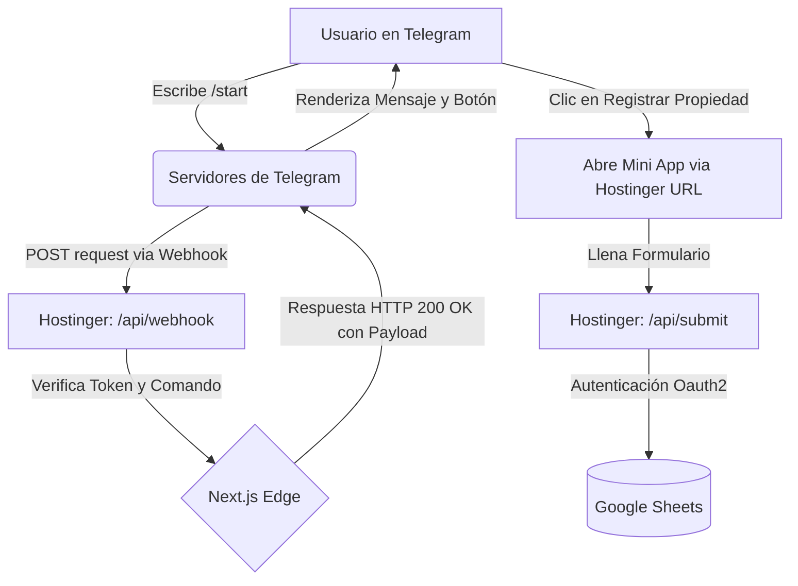

# ☁️ Manual Técnico de Despliegue en la Nube

> **Proyecto:** Lumark Group Telegram Mini App  
> **Entorno:** Producción (Cloud)  
> **Arquitectura:** API Routes & Webhooks

Este documento describe la arquitectura, las herramientas y el flujo de trabajo utilizado para migrar la aplicación de un entorno local (Localhost + Polling) a un entorno de producción escalable y disponible 24/7.

---

## 🛠 Ecosistema Tecnológico de Producción

### 1. GitHub (Control de Versiones y Despliegue Continuo)
- **Función:** Actúa como el repositorio central del código fuente y el puente automático hacia el servidor de producción.
- **Implementación:** El código está alojado en un repositorio privado en la cuenta `AXELONGO`. Cada vez que se hace un `git push` a la rama `main`, Hostinger es notificado automáticamente para reconstruir la app.

### 2. Hostinger "Node.js Web App" (Servidor)
- **Función:** Servidor de producción que aloja, compila y ejecuta la aplicación Next.js.
- **Configuración:**
  - **Framework:** Next.js (Turbopack)
  - **Node Version:** 22.x
  - **Seguridad:** Certificado SSL (HTTPS) nativo, requisito obligatorio para que Telegram permita la conexión.
  - **Variables de Entorno:** Inyectadas de forma segura desde el panel de control de Hostinger (Cloudinary, Google Sheets API y Telegram Token), manteniendo las credenciales fuera del código fuente.
- **Ventaja Operativa:** Elimina la dependencia de una computadora local encendida y de túneles inestables (como Localtunnel o Cloudflare Tunnel).

### 3. Telegram Webhooks (Arquitectura Push)
- **El Cambio de Paradigma:** Se eliminó el script aislado `bot.js` que utilizaba la técnica de **"Long Polling"** (preguntar a Telegram cada segundo si había mensajes nuevos).
- **La Solución (Webhooks):** Se integró la inteligencia del bot directamente adentro de Next.js mediante una "API Route" (`/api/webhook`). Ahora, Telegram empuja (hace push) de los mensajes directamente al servidor web solo cuando un usuario interactúa, ahorrando el 99% de los recursos del servidor.
- **Ruta de Configuración:** Se programó un endpoint (`/api/webhook/setup`) que automatiza el proceso de "enlazar" el dominio de Hostinger con la API de Telegram con un solo clic.

---

## 🔄 Diagrama de Flujo en la Nube

---

## 🚀 Guía de Mantenimiento

### Proceso para actualizar el código
Debido a la integración continua (CI/CD) establecida entre GitHub y Hostinger, actualizar la aplicación requiere solo 2 pasos:
1. Modificar el código localmente (por ejemplo, corregir un bug).
2. Ejecutar los comandos de Git (`git add .`, `git commit -m "..."`, `git push`).

Al terminar el `push`, **el trabajo manual termina**. Hostinger detecta el nuevo código, compila la versión actualizada (`npm run build`) y reinicia el servidor automáticamente sin interrupciones severas del servicio.

### Proceso para migrar a un nuevo dominio
Si el cliente decide comprar un dominio personalizado (ej. `propiedades.lumark.com`):
1. Configurar el dominio en el panel de Hostinger.
2. Actualizar la variable de entorno `WEB_APP_URL` en Hostinger con el nuevo dominio.
3. Visitar la ruta mágica en el navegador: `https://<NUEVO_DOMINIO>/api/webhook/setup?url=https://<NUEVO_DOMINIO>`.
4. El sistema se recalibrará automáticamente al nuevo dominio.
